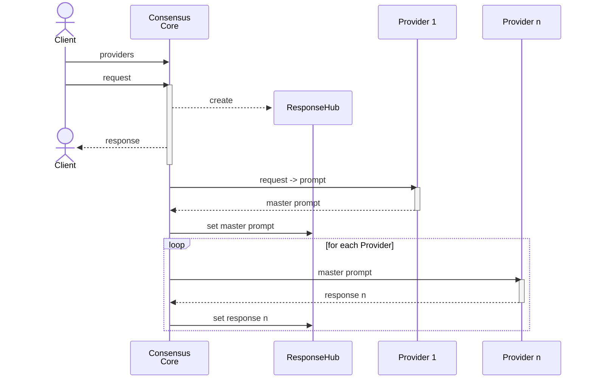
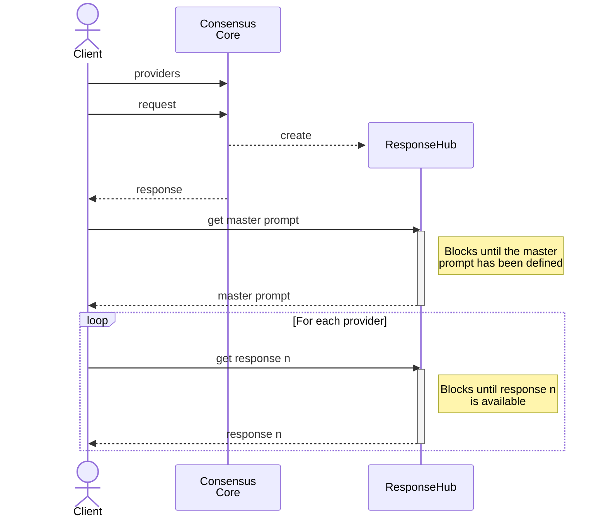

# Consensus as a Library - Design Document
Author: Daniel Munoz
Created: June 18th, 2025
Status: Draft

## Objective
The objective of this document is to outline the design and architecture of the Consensus as a Library project, which aims to provide a library for consensus-based decision-making in AI systems.

## Overview
The Consensus as a Library project is designed to facilitate consensus-based decision-making in AI systems by allowing multiple providers (e.g., LLMs) to contribute to a master prompt and responses. The library will handle the orchestration of requests, responses, and the management of providers.

## Architecture
The architecture of the Consensus as a Library project consists of the following components:
- **Client**: The entity that interacts with the Consensus Core to request providers and responses.
- **Consensus Core**: The core component that manages the providers, requests, and responses. It orchestrates the communication between the client and the providers.
- **Response Hub**: A component that acts as a mediator between the client and the Consensus Core, managing the responses and master prompt.
- **Providers**: The individual AI models (e.g., LLMs) that contribute to the master prompt and responses.

## Sequence Diagrams
### Sequence Diagram 1: Full Lifecycle of a Request
  

### Sequence Diagram 2: Client Interaction with Response Hub

